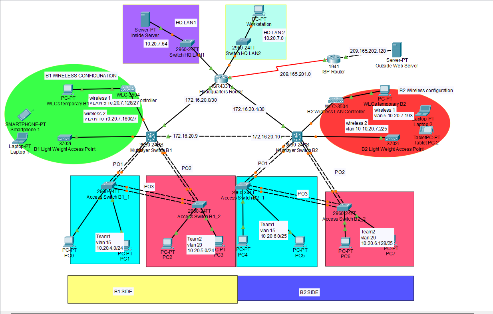

# Routing Overview and Implementation Project

This repository contains the configuration and implementation details for a comprehensive network design and troubleshooting project. The project showcases advanced networking skills using Cisco Packet Tracer to design, implement, and verify a fully functional network topology.

## Project Scope

This project involves the following tasks:
1. **IPv4 Address Planning**: Designed an efficient Variable Length Subnet Mask (VLSM) addressing scheme to conserve IP addresses.
2. **Switching and VLAN Configuration**: Configured VLANs, trunking, and EtherChannel on multilayer switches to optimize network performance.
3. **Routing Configuration**:
   - Set up inter-VLAN routing using SVIs.
   - Configured static and default routes for connectivity across all devices.
   - Implemented floating static routes for redundancy.
4. **Wireless Network Setup**: Configured Wireless LAN Controllers (WLCs) and Lightweight Wireless Access Points (LWAPs) with secure authentication protocols.
5. **DHCP and Security**:
   - Configured DHCP for all VLANs.
   - Implemented switch security features, including port security and DHCP snooping.

## Key Features

- **Network Topology**: Designed a multi-site network with two building sites (B1 and B2) and a headquarters (HQ).
- **Dynamic IP Allocation**: DHCP servers ensure seamless IP allocation across wired and wireless VLANs.
- **Enhanced Security**: Implemented port security, BPDU guard, and WPA2-Enterprise for robust network security.
- **Scalability**: Efficient use of IP address space with VLSM planning.

## Routing Overview Diagram

The diagram illustrates the topology, device configurations, and IP addressing scheme for the project.

## Repository Contents

- **`routingOverview.png`**: A detailed network diagram illustrating the topology, device configurations, and IP addressing scheme.
- **Configuration Files**: Contains device configurations for routers, switches, and WLCs.

## Hardware and Software Requirements

- **Cisco Packet Tracer**: Version 8.2.x or higher.
- **Networking Devices**: Simulated multilayer switches, routers, WLCs, and end-user devices.

## Usage

1. **Open Packet Tracer**: Import the provided `.pkt` file into Cisco Packet Tracer.
2. **Load Configurations**: Apply the configurations as documented in the project files.
3. **Verify Connectivity**: Test end-to-end connectivity and review routing tables to ensure proper operation.
4. **Simulate Failures**: Test the redundancy features by simulating link failures and verifying route failover.

## Summary

This project demonstrates proficiency in network design, configuration, and troubleshooting, highlighting skills in VLSM, VLANs, static routing, and wireless network security. The routing overview diagram provides a visual representation of the completed topology.

---

Feel free to explore the configurations and adapt them for similar network scenarios!
